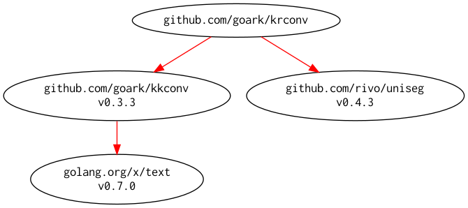

# [krconv] -- Convert kana-character to roman-alphabet

Convert kana-characters to roman-alphabets (by hepburn romanization)

[](https://github.com/goark/krconv/actions)
[](https://github.com/goark/krconv/actions)
[](https://raw.githubusercontent.com/goark/krconv/master/LICENSE)
[](https://github.com/goark/krconv/releases/latest)

This package is required Go 1.16 or later.

**Migrated repository to [github.com/goark/krconv][krconv]**

## Import

```go
import "github.com/goark/krconv"
```

## Usage

```go
package krconv_test

import (
	"fmt"

	"github.com/goark/krconv"
)

func ExampleConvert() {
	s := "マツエ テッペイ　めっちゃほりでぃ ﾅﾝﾊﾞかげつで まんざい みるんだょっ"
	fmt.Println(krconv.Convert(s))
	//Output:
	//matsue teppei metchahoridei nambakagetsude manzai mirundayotsu
}
```

## Modules Requirement Graph

[](./dependency.png)

[krconv]: https://github.com/goark/krconv "goark/krconv: Convert kana-character to roman-alphabet"
